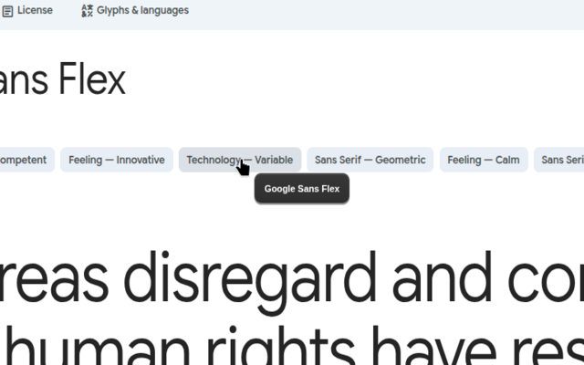
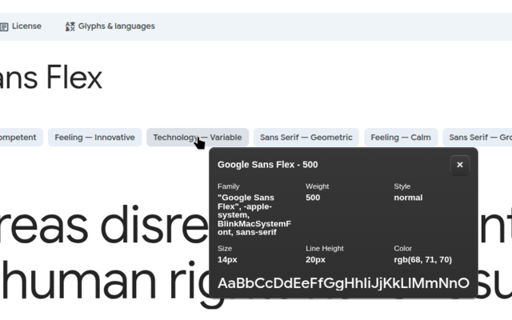
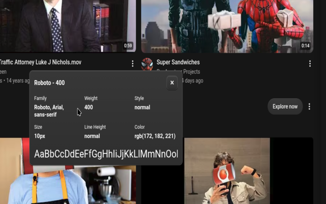

<div align="center">

# Font Inspector

### Inspect any font on any webpage — instantly.

A lightweight Chrome extension for developers, designers, and typography enthusiasts. Hover over text to identify the font being used, then click to inspect detailed typography properties without opening DevTools.

[](https://chromewebstore.google.com/detail/font-inspector/kbgfcedmpchjoofhjdjclhoahhjcnbbf)
[](LICENSE)
[](https://developer.chrome.com/docs/extensions/develop/migrate/what-is-mv3)

</div>

---

## What is Font Inspector?

**Font Inspector** makes it easy to discover exactly how typography is implemented on a webpage.

Activate the extension, move your cursor over any text, and Font Inspector shows the font currently applied to that element. Click the element for a more detailed view containing properties such as font family, weight, size, style, line height, and color.

No DevTools. No digging through CSS. Just point and inspect.

## Preview

## Preview

<table>
  <tr>
    <td></td>
    <td></td>
  </tr>
  <tr>
    <td></td>
    <td></td>
  </tr>
</table>


## Features

- **Instant font detection** — hover over text to see the font being used.
- **Detailed typography inspection** — inspect the computed typography of an element.
- **Font family** — see the actual font-family stack applied to the element.
- **Font weight** — identify the current weight, such as 400 or 500.
- **Font size** — see the computed font size.
- **Font style** — distinguish normal, italic, and other styles.
- **Line height** — inspect the element's computed line height.
- **Text color** — view the computed text color.
- **Live inspection** — inspect fonts directly on the page you are viewing.
- **Minimal overlay** — information appears in a compact interface without disrupting the page.
- **No account required** — install it and start inspecting.
- **Privacy-focused** — the extension does not collect or use user data.

## How it works

```text
Open a webpage
      │
      ▼
Activate Font Inspector
      │
      ▼
Hover over text
      │
      ▼
See the detected font
      │
      ▼
Click the element
      │
      ▼
Inspect detailed typography
```

## Use cases

### Frontend development

Quickly identify typography while rebuilding or debugging a UI.

### UI/UX design

Understand the typography choices used across real-world interfaces.

### Design systems

Inspect font families, weights, sizes, and line heights when documenting or reproducing a design system.

### Learning

Explore how websites use typography and see the computed CSS values behind the text you are reading.

### Typography research

Compare typefaces and their implementation across different websites.

## Installation

### Chrome Web Store

Install the published extension directly from the Chrome Web Store:

**Font Inspector:** https://chromewebstore.google.com/detail/font-inspector/kbgfcedmpchjoofhjdjclhoahhjcnbbf

### From source

If you want to develop or modify the extension locally:

#### 1. Clone the repository

```bash
git clone https://github.com/Nucletic/Font-Inspector.git
cd Font-Inspector
```

#### 2. Install dependencies

```bash
npm install
```

#### 3. Start the development server

```bash
npm run dev
```

#### 4. Build the extension

```bash
npm run build
```

The production extension will be generated in the `dist` directory.

#### 5. Load it into Chrome

1. Open `chrome://extensions`
2. Enable **Developer mode**
3. Click **Load unpacked**
4. Select the generated `dist` directory

## Usage

1. Open any webpage.
2. Click the **Font Inspector** extension icon.
3. Move your cursor over text.
4. The detected font appears immediately.
5. Click the text element to open detailed typography information.
6. Move to another element to inspect its font.

## Typography information

Depending on the inspected element, Font Inspector can expose information such as:

| Property | Example |
| --- | --- |
| Font family | `Roboto, Arial, sans-serif` |
| Font weight | `400`, `500`, `700` |
| Font size | `14px`, `16px`, `24px` |
| Font style | `normal`, `italic` |
| Line height | `20px`, `normal` |
| Color | `rgb(172, 182, 221)` |

The values shown are based on the typography applied to the element being inspected.

## Tech stack

- React
- TypeScript
- Vite
- CRXJS
- Chrome Extensions Manifest V3
- CSS

## Project structure

```text
Font-Inspector/
├── public/
├── src/
├── assets/
├── manifest.config.ts
├── index.html
├── package.json
├── tsconfig.json
├── vite.config.ts
└── README.md
```

## Privacy

Font Inspector is designed to work locally in the browser.

- No account is required.
- No analytics are required for the core functionality.
- No user data is collected or sold.
- Font inspection happens directly on the webpage being inspected.

For the current privacy disclosure, see the extension's privacy policy:

https://font-inspector.netlify.app/

## Contributing

Contributions are welcome.

If you find a bug or have an idea for improving Font Inspector:

1. Open an issue describing the problem or feature.
2. For code changes, fork the repository.
3. Create a feature branch.
4. Make your changes.
5. Test the extension locally.
6. Open a pull request with a clear description of the changes.

## Development

Before submitting changes, make sure the extension builds successfully:

```bash
npm run build
```

When working on the extension, please keep changes focused and avoid introducing unnecessary dependencies.

## License

Font Inspector is open source and available under the **MIT License**.

See [LICENSE](LICENSE) for the full license text.

---

<div align="center">

**Font Inspector**

Inspect typography. Understand the web.

[Chrome Web Store](https://chromewebstore.google.com/detail/font-inspector/kbgfcedmpchjoofhjdjclhoahhjcnbbf) · [GitHub](https://github.com/Nucletic/Font-Inspector)

</div>
